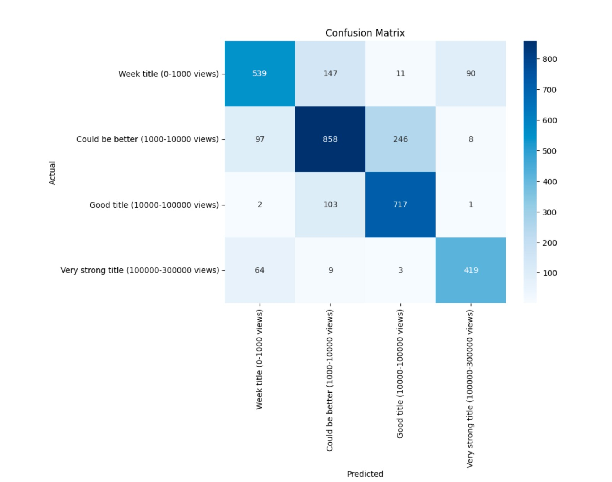

# YouTube Video Titles & Their Influence Over Views

This project involved developing a system to analyze YouTube video titles and rank the titles of videos to help content creators maximize views and engagement.

## Overview:

* Scraped YouTube data using an API key for over 50,000 videos across different genres like gaming, entertainment, education, etc.
* Analyzed the relationship between video title properties like length and the number of views.
* Formulated and statistically tested hypotheses on whether:
  * **Title length correlates with higher views**
  * **Entertainment category titles get more views than Gaming**
* Built regression and classification models, including:
  * **ElasticNet Regression**
  * **ElasticNet with BERT Embeddings**
  * **BERT Classification Model**
* BERT classifier achieved the best accuracy of 76% in predicting title strength (see plot below)
  

